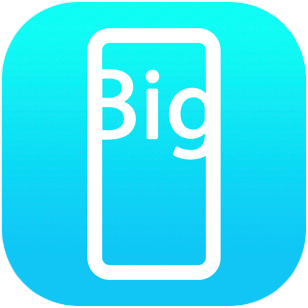

# Big Textbox

Big Textbox is an unreleased iOS app that displays large text of the contents in the text editor. It is my first app.

The purpose of this app is to solve the amusingly common problem I have of: "I wish I could order food in person without repeating myself a bunch of times, because I have a quiet voice and the mask makes me even quieter." Plus, germs spread from talking, so visual communication seems like a good idea anyway.

Features:

- Automatic font size adjustment: Font size changes automatically to fit all the text on one screen while keeping the size as large as possible.
- Transitions: When the editing area slides into view from the top, the big textbox area simultaneously blurs out of focus.
- Intuitive: When the editor is blank, "tap to open editor" displays as the big text placeholder. The user can tap the screen to bring up the edit menu, edit their text, and then tap again (or tap the "Done" button) to close it.

Wishlist:

- Favorites. It would be nice to bring up common phrases without having to retype them.
- Better dark mode compatibility. The black editor textbox is currently hard to see against a black background.
- Focus to textbox automatically when the editor window slides in.

   

