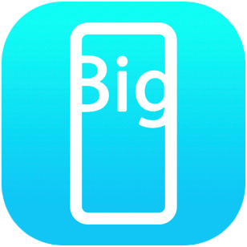

# Big Textbox

Big Textbox is an iOS app that displays editable, large text on the screen. 

https://github.com/chloenott/big-textbox/blob/main/documentation-assets/sample-480.mp4

The purpose of this app is be able to type a message in the editor, then display the large text version to another person so they can read it easily from a distance.

- Font size stays big and adjusts as needed to fit on the screen.
- Custom text can be typed in, or
- Favorited phrases can be selected from the favorites list.
