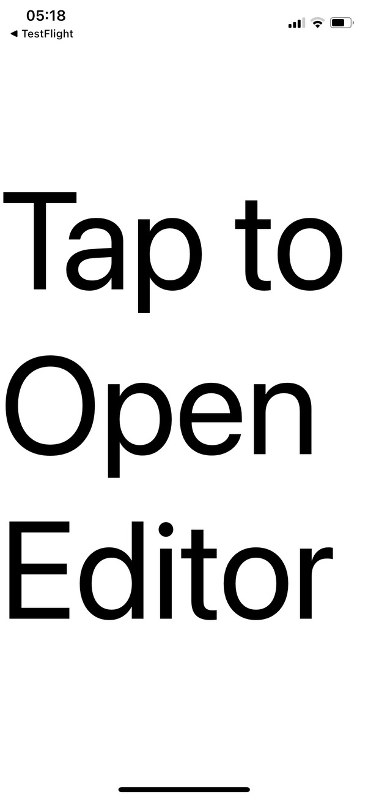
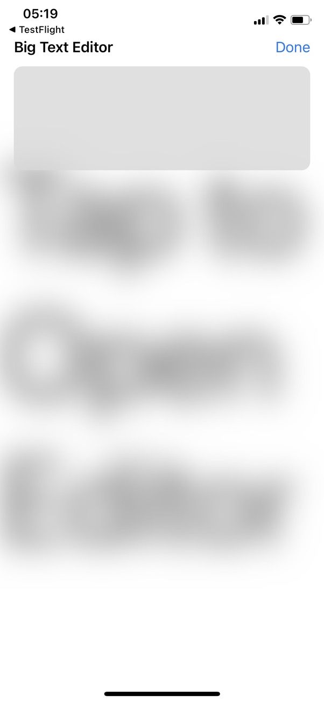
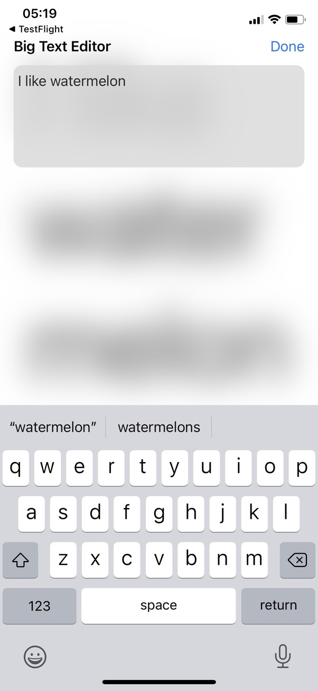
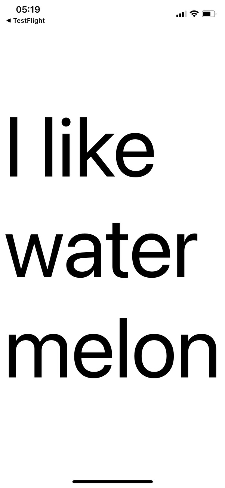

# Big Textbox

Big Textbox is an unreleased iOS app that simply shows the large text of whatever is typed into the editor and resizes the text as needed to fit on the screen. It is my first app that I have been able to run on my phone with TestFlight.

The purpose of this app is to solve the amusingly common problem I have of: "I wish I could order food in person without repeating myself, because I have a quiet voice and the mask makes me even quieter." Plus, germs spread from talking, so visual communication seems like a good idea anyway.

Features:

- Font size decreases automatically to fit all the text on one screen.
- Transitions were added to make it feel more natural. For example, when the editing area slides into view from the top, the big textbox area simultaneously blurs out of focus. Quick durations so that they don't impede functionality.
- Interface is reasonably intuitive. The user can tap the screen to bring up the edit menu, and tap again (or use the Done button) to close it.
- An app icon was created trying to keep the style guidelines in mind.

Wishlist:

- Favorites. It would be nice to bring up common phrases without having to retype them.
- Better dark mode compatibility. The black editor textbox is currently hard to see against a black background.

   

